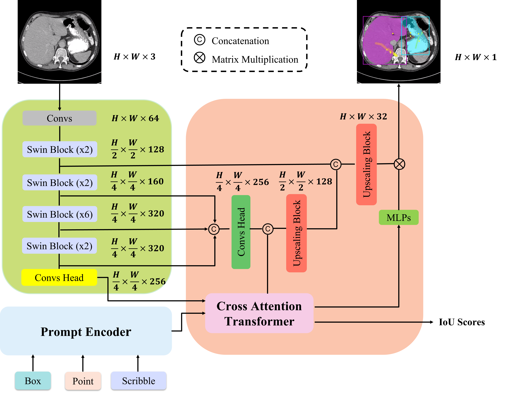

## [Swin-LiteMedSAM] Submission to the [SEGMENT ANYTHING IN MEDICAL IMAGES ON LAPTOP](https://www.codabench.org/competitions/1847/) 2024 CVPR challenge [Teamname: lkeb]

<p align="center">
  
</p>


## Install

- Create a virtual environment `conda create -n swin_litemedsam python=3.10 -y` and activate it `conda activate swin_litemedsam`
- Install Pytorch 2.x
- Enter the Swin_MedSAM folder `cd Swin_LiteMedSAM` and run `pip install -e .`

## Model 
- Download the [model checkpoint](https://drive.google.com/file/d/1x587vVKtPZ2sGcC29gKsHO0Ha7YZTVO4/view?usp=sharing) and place it at `workdir`
- Donwload the [docker image](https://drive.google.com/file/d/1UnDZaRk6vtrzR6BJDBxDA7m4B3HGpxjg/view?usp=sharing) and load it `docker load -i lkeb.tar.gz` for quick inference
## Usage

1. Data Preparation

    - Download training data from [challenge website]((https://www.codabench.org/competitions/1847/))

    The training data contained 11 modalities, including Computed Tomography (CT), Magnetic Resonance Imaging (MRI), Positron Emission Tomography (PET), X-ray, ultrasound, mammography, Optical Coherence Tomography (OCT), endoscopy, fundus, dermoscopy, and microscopy.

2. Train
    - Distill encoder
    ```shell
    cd distill
    python train_distill.py
    ```
    - Only train decoder
    ```shell
    python train.py
    ```
    - Train encoder & decoder together
    ```shell
    python train.py -freeze False
    ```

    
3. Docker Infer

   
    - Load the docker
    ```
    docker load -i lkeb.tar.gz
    ```
    - Run the docker infer case in `$PWD/imgs` 

    ```
    docker container run -m 8G --name lkeb --rm -v $PWD/imgs/:/workspace/inputs/ -v $PWD/lkeb/:/workspace/outputs/ lkeb:latest /bin/bash -c "sh predict.sh"
    ```
    - if you run into Permission denied error.

    ```
    chmod -R 777 ./*
    ```


