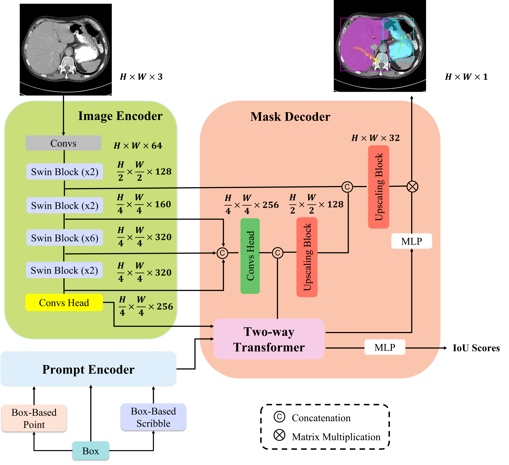

## [Swin-LiteMedSAM] Submission to the [SEGMENT ANYTHING IN MEDICAL IMAGES ON LAPTOP](https://www.codabench.org/competitions/1847/) 2024 CVPR challenge [Teamname: lkeb]

<p align="center">
  
</p>

## Peformance

Placeholder. Final results will be released reduring CVPR (6.17-18)


## Install

- Create a virtual environment `conda create -n swin_litemedsam python=3.10 -y` and activate it `conda activate swin_litemedsam`
- Install Pytorch 2.x
- Enter the Swin_MedSAM folder `cd Swin_LiteMedSAM` and run `pip install -e .`


## Usage

1. Data Preparation

    - Download training data from [challenge website]((https://www.codabench.org/competitions/1847/))


    The training data contained 11 modalities, including Computed Tomography (CT), Magnetic Resonance Imaging (MRI), Positron Emission Tomography (PET), X-ray, ultrasound, mammography, Optical Coherence Tomography (OCT), endoscopy, fundus, dermoscopy, and microscopy.

    - convert training npz file to npy file

    ```shell
    cd dataset_conversion
    python train_npz2npy.py
    ```


2. Train
    - Distill encoder
    ```shell
    cd distill
    python train_distill.py
    ```
    - Train decoder
    ```shell
    python train.py
    ```
    - Train encoder & decoder together
    ```shell
    python train.py -freeze False
    ```
3. Infer
    - Build the docker Image (you can replace lkeb)
    ```shell
    docker build -f Dockerfile -t lkeb .
    ```

    - Run the docker infer case in `$PWD/imgs` 
    ```
    docker container run -m 8G --name lkeb --rm -v $PWD/imgs/:/workspace/inputs/ -v $PWD/lkeb/:/workspace/outputs/ lkeb:latest /bin/bash -c "sh predict.sh"
    ```


    - if you run into Permission denied error.

    ```
    chmod -R 777 ./*
    ```

    - save and load the docker
    ```
    docker save lkeb | gzip -c > lkeb.tar.gz
    docker load -i lkeb.tar.gz
    ```

